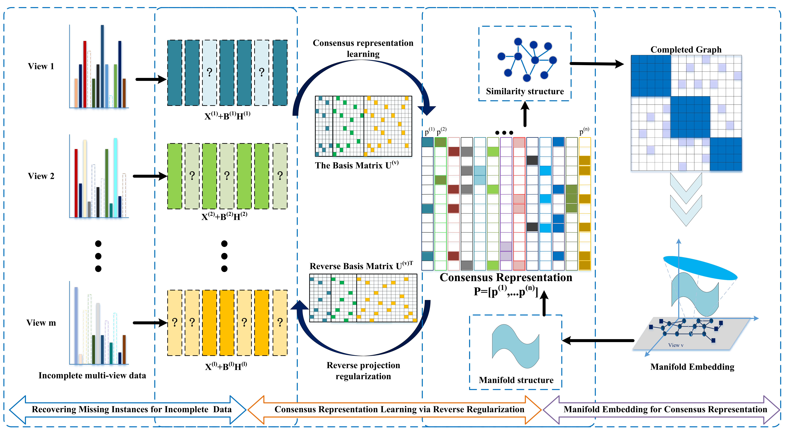

# MIMB：Manifold-based Incomplete Multi-view Clustering via Bi-Consistency Guidance
 
### [Paper]()

This repository is the official code for the paper "Manifold-based Incomplete Multi-view Clustering via Bi-Consistency Guidance" by Huibing Wang(huibing.wang@dlmu.edu.cn), Mingze Yao(ymz0284@dlmu.edu.cn), Yawei Chen, Yunqiu Xu, Haipeng Liu, Wei Jia, Xianping Fu, Yang Wang. lEEE Transactions on Multimedia 2024

## Introduction
In this paper, we have proposed a novel method termed Manifold-based Incomplete Multi-view Clustering via Bi-Consistency Guidance (MIMB), which flexibly recover the incomplete data among various views and intends to achieve the bi-consistency guidance via reverse regularization. In particular, MIMB adds the reconstruction terms to representation learning with recovering the missing instances, which can dynamically explore the latent consensus representation. Meanwhile, to preserve the consistency information among multiple views, MIMB implements a bi-consistency guidance strategy with reverse regularizing on consensus representation and proposes manifold embedding measure for exploring the hidden structure of recovered data. Notably, MIMB intends to balance the different views’ importance, and has introduced an adaptive weight term for each view. Finally, the optimization algorithm with an alternating iteration optimize strategy is designed for final clustering.



## Dependencies
* OS: Windows 11
* Matlab2020b
* Related measure can be obtained in `.\Measure`.

## Data Preparation
+ We have provided 3sources dataset with 50\% missing ratio for instance, and the `findindex.m file` is provided to data preparation.
+ The natural imcomplete 3sources can be obtained in `.\datasets`.
+ To generate the incomplete views, we randomly remove 10\%, 30\%, 50\% samples of each view and at least preserve one view existing.

## Usage
+ Conduct clustering
  run  `demo_3sources.m`. The relevant hyperparameter settings have been provided in the code

##  Citation
If any part of our paper and repository is helpful to your work, please generously cite with:

```
@article{wang2024mimb,
      title={Manifold-based Incomplete Multi-view Clustering via Bi-Consistency Guidance}, 
      author={Huibing Wang, Mingze Yao, Yawei Chen, Yunqiu Xu, Haipeng Liu, Wei Jia, Xianping Fu, Yang Wang},
      journal={IEEE Transactions on Multimedia}, 
      year={2024},
}
```
